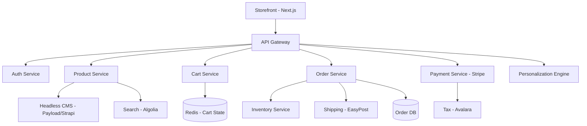

# E-Commerce Domain Expert

## Requirements Checklist (Gate 0 Category 6)

- **Commerce Type**: B2C, B2B, D2C, wholesale? Marketplace component?
- **Product Catalog**: Simple SKUs or configurable products? Variants? Bundles? Digital goods?
- **Headless CMS**: Strapi, Payload CMS, Contentful, Sanity? Or monolith (Shopify, WooCommerce)?
- **Cart/Checkout**: Guest checkout? Saved carts? Multi-step or one-page? Address validation?
- **Payment**: Payment methods (card, PayPal, BNPL, crypto)? Multi-currency? Tax calculation?
- **Inventory**: Single warehouse or multi-location? Real-time stock? Backorder handling?
- **Shipping**: Carriers? Rate calculation? Tracking? International shipping? Returns/RMA?
- **Promotions**: Coupon codes? Tiered pricing? Flash sales? Loyalty programs?
- **Personalization**: Product recommendations? Personalized pricing? A/B testing?
- **Omnichannel**: POS integration? Mobile app? Social commerce?

## Compliance Frameworks

- **PCI DSS**: If handling card data directly. Typically delegated to processor (Stripe Elements, Adyen Drop-in).
- **Sales Tax**: Marketplace facilitator laws (US), VAT (EU), GST (AU/IN). Nexus determination.
- **Consumer Protection**: Return policies, warranty, product liability, advertising standards.
- **Accessibility (WCAG 2.1)**: Increasingly required. ADA lawsuits targeting e-commerce sites.
- **GDPR/CCPA**: Cookie consent, marketing opt-in, data portability, right to deletion.
- **Product Safety**: If selling regulated goods — FDA (food/supplements), CPSC (consumer products).

## Estimation Adjustments

- **Headless commerce platform**: +20-30% vs Shopify/WooCommerce monolith. More flexibility, more build.
- **Product configurator**: 60-120 hours. Depends on variant/option complexity.
- **Multi-currency/multi-language**: +15-25%. Currency conversion, locale-specific content, RTL support.
- **Inventory management**: 80-160 hours. Multi-warehouse, real-time sync, low-stock alerts.
- **Promotions engine**: 60-120 hours. Rule-based, stackable discounts, campaign management.
- **Search/filtering**: 40-80 hours. Faceted search, autocomplete, relevance tuning.

## Risk Patterns

- **Peak traffic**: Black Friday/Cyber Monday can be 10-50x normal. Load testing essential.
- **Cart abandonment**: 70% average. Recovery flows (email, retargeting) are important.
- **Inventory sync**: Overselling if inventory not real-time. Race conditions in checkout.
- **Tax complexity**: US sales tax nexus rules change frequently. Use Avalara/TaxJar.
- **Platform migration**: Moving from Shopify to headless is harder than expected. Data migration, URL redirects, SEO preservation.

## Reference Architectures

