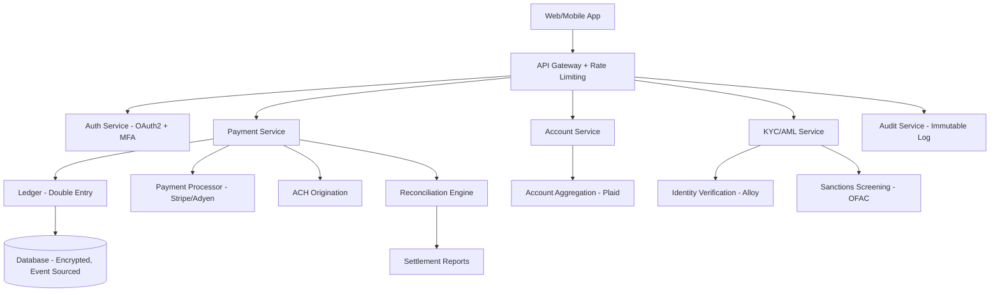

# Fintech Domain Expert

## Requirements Checklist (Gate 0 Category 6)

Verify these domain-specific items during intake:

- **Financial Products**: What type? Payments, lending, insurance, wealth management, banking-as-a-service, crypto/digital assets?
- **Licensing**: Money transmitter licenses? State-by-state requirements? Sponsor bank relationship?
- **Payment Processing**: Card-present or card-not-present? ACH, wire, real-time payments (RTP/FedNow)? Cross-border?
- **KYC/AML**: Customer identification program? Enhanced due diligence? Sanctions screening (OFAC)? Transaction monitoring?
- **Fraud Detection**: What fraud vectors? Card fraud, account takeover, synthetic identity, first-party fraud?
- **Banking Integration**: Core banking system? Open banking APIs? Plaid/MX/Yodlee for account aggregation?
- **Regulatory Reporting**: SAR filing? CTR filing? 1099 reporting? State-specific reporting?
- **Data Classification**: PII, PCI cardholder data, financial records. What's in scope?
- **Reconciliation**: Double-entry bookkeeping? Settlement reconciliation? Multi-currency?
- **Audit Requirements**: SOX compliance? External audit readiness? Regulatory examination prep?

## Compliance Frameworks

- **PCI DSS**: If handling card data. Level 1 (>6M transactions/year) requires QSA audit. Level 2-4 self-assessment. SAQ types depend on integration method.
- **SOX (Sarbanes-Oxley)**: If publicly traded or preparing for IPO. Internal controls over financial reporting. IT General Controls (ITGC).
- **BSA/AML (Bank Secrecy Act)**: Anti-money laundering program. Customer Due Diligence (CDD) rule. Suspicious Activity Reports (SARs).
- **GLBA (Gramm-Leach-Bliley)**: Financial privacy. Safeguards Rule for customer information.
- **Reg E**: Electronic fund transfers. Consumer protections. Error resolution procedures. Unauthorized transaction liability.
- **CFPB Regulations**: Consumer Financial Protection Bureau. Fair lending, UDAAP, complaint handling.
- **State Money Transmitter Laws**: 49 states + DC + territories. Each has unique requirements, bonds, and examination schedules.
- **GDPR/CCPA**: If handling personal data of EU/California residents in financial context.
- **PSD2/Open Banking**: If operating in EU/UK. Strong Customer Authentication (SCA). Account information/payment initiation services.

## Integration Patterns

- **Card Networks**: Visa, Mastercard, Amex via processors (Stripe, Adyen, Worldpay). Authorization, capture, settlement, chargebacks.
- **ACH**: NACHA format. Same-day ACH available. Originator/ODFI/RDFI model. Return codes (R01-R85).
- **Wire Transfers**: SWIFT (international), Fedwire (domestic). Irrevocable. Higher cost.
- **Real-Time Payments**: FedNow, RTP (The Clearing House). 24/7/365. Instant settlement.
- **Account Aggregation**: Plaid, MX, Yodlee, Finicity. Screen scraping vs API-based. Credential storage concerns.
- **Core Banking**: FIS, Fiserv, Jack Henry, Temenos, Thought Machine. Integration complexity varies wildly.
- **Identity Verification**: Jumio, Onfido, Socure, Alloy. Document verification + liveness detection + watchlist screening.
- **Credit Bureaus**: Experian, Equifax, TransUnion. Soft/hard pulls. VantageScore/FICO.

Common notes:
- Stripe: best-documented, fastest integration. 40-60h for basic, 80-140h for Connect/marketplace.
- Plaid: reliable for US bank account linking. 24-40h integration. Credential-based access being phased out.
- Core banking APIs: highly variable. 200-500h+ depending on vendor and use case. Always budget for surprises.

## Estimation Adjustments

- **PCI DSS compliance**: +10-20% of total. Network segmentation, encryption, key management, vulnerability scanning, pen testing. Level 1 QSA audit adds $50K-$200K.
- **KYC/AML program**: 120-240 hours. Identity verification integration, transaction monitoring rules, SAR workflow, compliance dashboard.
- **Multi-state licensing**: Non-engineering cost but affects timeline. 3-12 months. $100K-$500K in legal/licensing fees.
- **Financial calculations**: +10-15%. Decimal arithmetic mandatory (no floating point). Rounding rules per jurisdiction. Extensive unit testing.
- **Reconciliation systems**: 80-160 hours. Double-entry ledger, settlement matching, exception handling.
- **Regulatory reporting**: 60-120 hours per report type. SAR, CTR, 1099, state-specific.
- **Fraud detection**: 120-240 hours. Rule engine + ML models + case management. Ongoing tuning required.
- **SOX audit preparation**: 80-160 hours. ITGC documentation, access reviews, change management evidence.

## Risk Patterns

- **Regulatory changes**: Fintech regulation evolving rapidly. CFPB enforcement actions. State-level crypto regulations.
- **Fraud losses**: Budget for fraud losses in business model. Chargeback rates > 1% trigger Visa/MC monitoring programs.
- **Sponsor bank dependency**: If using BaaS, sponsor bank can change terms or drop the relationship. Have contingency.
- **Money transmitter delays**: State licensing can take 6-18 months. Can block launch in specific states.
- **PCI scope creep**: Once card data touches a system, PCI scope expands. Minimize cardholder data environment.
- **Decimal precision bugs**: Float arithmetic errors in financial calculations = compliance violation + customer trust loss.
- **Settlement timing**: ACH takes 1-3 business days. User expects instant. Managing expectations critical.
- **Third-party risk**: Processors, BaaS providers, data aggregators can have outages. Build resilience.

## Reference Architectures

Fintech payment platform (typical):

