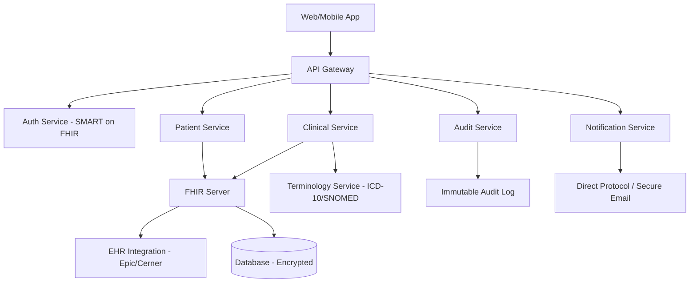

# Healthcare Domain Expert

## Requirements Checklist (Gate 0 Category 6)

Verify these domain-specific items during intake:

- **EHR Systems**: Which vendor(s)? Epic, Cerner (Oracle Health), Athena, eClinicalWorks, Allscripts, DrChrono? Version? Interconnect/API availability?
- **PHI Handling**: What Protected Health Information flows through the system? At rest, in transit, in logs? De-identification requirements?
- **Clinical Workflows**: Which clinical workflows are affected? Order entry, results review, scheduling, documentation, billing?
- **HIPAA Status**: Current compliance status? Existing BAAs? Security Risk Assessment done?
- **Medical Terminology**: Which standards? ICD-10, SNOMED CT, LOINC, CPT, RxNorm?
- **Patient Identity**: MPI (Master Patient Index)? Patient matching strategy? Cross-system identity?
- **Consent Management**: Research consent, treatment consent, data sharing consent? Granularity?
- **Telehealth**: Video/audio? HIPAA-compliant platform? State licensing requirements?
- **Medical Devices**: Any IoT/device integration? FDA regulations (21 CFR Part 11)?
- **Billing/Claims**: Insurance verification, claims submission, ERA/EOB processing?

## Compliance Frameworks

- **HIPAA Privacy Rule**: PHI use/disclosure, minimum necessary, patient rights (access, amendment, accounting of disclosures)
- **HIPAA Security Rule**: Administrative, physical, technical safeguards. Risk analysis required.
- **HITECH Act**: Breach notification (60 days), business associate requirements, meaningful use
- **42 CFR Part 2**: Substance abuse records — stricter than HIPAA, requires specific consent
- **State Laws**: Many states have stricter privacy laws (California CCPA/CMIA, Texas HB 300, New York SHIELD Act)
- **FDA 21 CFR Part 11**: If software is a medical device or handles clinical trial data — electronic records/signatures
- **ONC Health IT Certification**: If EHR-facing, may need certification criteria compliance

## Integration Patterns

- **FHIR R4**: Modern standard. RESTful API. Resources: Patient, Observation, Encounter, MedicationRequest, etc. SMART on FHIR for auth.
- **HL7v2**: Legacy but ubiquitous. ADT (admit/discharge/transfer), ORM (orders), ORU (results), SIU (scheduling). TCP/MLLP transport.
- **CDA/CCDA**: Clinical Document Architecture — XML-based clinical documents. Continuity of Care Document (CCD).
- **DICOM**: Medical imaging. PACS integration. Study/Series/Instance hierarchy.
- **X12 EDI**: Insurance claims (837), eligibility (270/271), claim status (276/277), remittance (835).
- **Direct Protocol**: Secure email for healthcare. Used for provider-to-provider communication.

Common vendor integration notes:
- Epic: Interconnect API (FHIR R4 + proprietary). Requires App Orchard registration. Sandbox available.
- Cerner: Ignite APIs (FHIR R4). Millennium platform. Code Console for development.
- Athena: athenaNet API. REST-based. Partner program required.
- eClinicalWorks: API requires vendor relationship. Less standardized. Expect longer integration timelines.

## Estimation Adjustments

- **HIPAA compliance infrastructure**: +15-25% of total project budget. Includes audit logging, encryption, BAA preparation, penetration testing, security risk assessment.
- **FHIR integration per EHR vendor**: 120-200 hours. Epic is typically fastest, eClinicalWorks slowest. Add 40% for team's first FHIR integration.
- **HL7v2 integration**: 80-160 hours per message type. Interface engines (Mirth Connect, Rhapsody) reduce effort but add licensing cost.
- **Clinical workflow validation**: +10-15%. Requires clinician input for user acceptance testing.
- **PHI data migration**: 2-3x standard data migration estimates. Data quality, de-duplication, identity matching.
- **Compliance documentation**: 80-120 hours for policies, procedures, risk assessment, BAA templates.
- **FDA clearance path (if applicable)**: 6-18 months additional. $50K-$500K+ depending on device class.

## Risk Patterns

- **EHR vendor API deprecation**: Vendors change APIs without adequate notice. Build abstraction layers.
- **Regulatory changes mid-project**: HIPAA/CMS rules update annually. Budget for compliance monitoring.
- **Clinical workflow resistance**: Clinicians resist workflow changes. Involve clinical champions early.
- **PHI in test data**: Never use real PHI in development/testing. Synthetic data generation needed.
- **State law variations**: Multi-state deployments multiply compliance effort. Each state may have unique requirements.
- **Interoperability mandates**: ONC Information Blocking rules — may require specific data sharing capabilities.
- **Breach notification costs**: Average healthcare breach costs $10.93M (IBM 2023). Justify security investment.

## Reference Architectures

Healthcare SaaS platform (typical):

