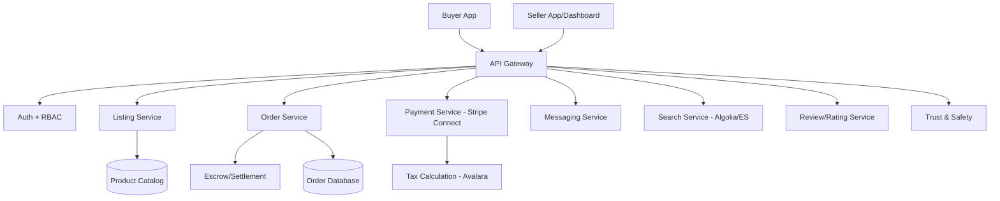

# Marketplace Domain Expert

## Requirements Checklist (Gate 0 Category 6)

- **Marketplace Type**: Two-sided (buyer/seller)? Multi-sided? Services vs products? B2B vs B2C?
- **Supply/Demand**: Who are the suppliers? How do they onboard? Verification/vetting process?
- **Monetization**: Commission model? Subscription? Listing fees? Featured placement?
- **Payment Flow**: Escrow? Split payments? Payout schedules? Multi-currency?
- **Trust & Safety**: How to handle fraud, disputes, chargebacks, content moderation?
- **Search & Discovery**: How do buyers find sellers/products? Categories, filters, geo, recommendations?
- **Messaging**: Buyer-seller communication? In-app vs email? Contact info protection?
- **Reviews/Ratings**: Rating system? Review moderation? Fake review detection?
- **Logistics**: Shipping integration? Delivery tracking? Returns? Digital delivery?
- **Regulatory**: Platform liability (Section 230)? Tax collection (marketplace facilitator laws)?

## Compliance Frameworks

- **PCI DSS**: If handling payments (usually delegated to processor like Stripe Connect)
- **Marketplace Facilitator Tax Laws**: 45+ US states require marketplace to collect/remit sales tax
- **Consumer Protection**: FTC Act, state consumer protection laws, refund policies
- **Platform Liability**: Section 230 (US), Digital Services Act (EU), Online Safety Act (UK)
- **GDPR/CCPA**: User data, seller data, behavioral data, cross-border transfers
- **Employment Classification**: If services marketplace — independent contractor vs employee risk

## Integration Patterns

- **Stripe Connect**: Standard for marketplace payments. Custom/Express/Standard account types. 80-140h for full implementation.
- **Tax Calculation**: Avalara, TaxJar. Sales tax, VAT, GST calculation and reporting.
- **Shipping**: ShipStation, EasyPost, Shippo. Rate comparison, label generation, tracking.
- **Identity Verification**: For seller onboarding. Stripe Identity, Jumio, Onfido.
- **Communication**: SendBird, Stream, Twilio for in-app messaging. 40-80h.
- **Search**: Algolia, Elasticsearch. Faceted search, geo-search, relevance tuning. 40-80h.
- **Media**: Cloudinary, imgix for image processing. CDN for static assets.

## Estimation Adjustments

- **Payment escrow/split**: +20-30% vs standard payments. Stripe Connect significantly reduces this.
- **Trust & safety system**: 120-200 hours. Fraud detection, dispute resolution workflow, content moderation.
- **Search/discovery**: 60-120 hours. Depends on catalog size and matching complexity.
- **Seller onboarding**: 80-120 hours. Verification, profile, payout setup, dashboard.
- **Multi-sided pricing**: +10-15%. Complex commission logic, promotions, featured listings.
- **Tax compliance**: 40-80 hours + ongoing Avalara/TaxJar subscription.

## Risk Patterns

- **Chicken-and-egg**: Need supply to attract demand and vice versa. Affects launch strategy.
- **Payment fraud**: Marketplace fraud patterns differ from e-commerce. Seller fraud, buyer fraud, collusion.
- **Seller quality**: Bad sellers damage platform reputation. Invest in vetting and monitoring.
- **Regulatory evolution**: Marketplace facilitator laws expanding. Gig economy regulations (AB5-style).
- **Disintermediation**: Buyers/sellers taking transactions off-platform. Address with value-add features.

## Reference Architectures

