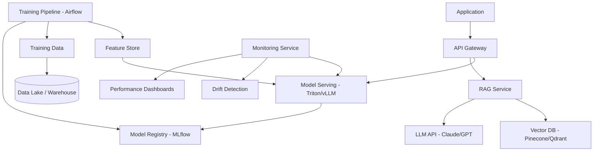

# ML/AI Domain Expert

## Requirements Checklist (Gate 0 Category 6)

- **ML Type**: Classification, regression, NLP, computer vision, recommendation, generative AI, time series?
- **Data Sources**: What data exists? Volume? Quality? Labeled or unlabeled? Real-time or batch?
- **Model Lifecycle**: Training frequency? Online learning? A/B testing? Model versioning?
- **Infrastructure**: GPU requirements? Cloud (AWS SageMaker, GCP Vertex AI, Azure ML)? On-prem?
- **Inference**: Real-time (latency SLA?) or batch? Edge deployment? Model serving strategy?
- **LLM Integration**: Using foundation models (GPT, Claude, Llama)? Fine-tuning? RAG? Prompt engineering?
- **Data Privacy**: PII in training data? Model memorization risks? Differential privacy?
- **Explainability**: Model interpretability requirements? SHAP/LIME? Regulatory explainability?
- **Bias/Fairness**: Protected attributes? Fairness metrics? Demographic parity? Equal opportunity?
- **Monitoring**: Model drift detection? Data quality monitoring? Performance degradation alerts?

## Compliance Frameworks

- **EU AI Act**: Risk-based classification. High-risk AI systems require conformity assessment.
- **GDPR Art. 22**: Automated decision-making. Right to explanation. Human-in-the-loop requirements.
- **FDA/SaMD**: If AI is a Software as Medical Device — requires regulatory pathway (510k, De Novo, PMA).
- **Fair Lending (ECOA/Reg B)**: If used for credit decisions — adverse action notices, disparate impact testing.
- **CCPA/State AI Laws**: Colorado AI Act, Illinois BIPA (biometric data), NYC Local Law 144 (automated employment decisions).
- **NIST AI RMF**: Voluntary framework. Govern, Map, Measure, Manage. Good baseline for any AI system.

## Integration Patterns

- **MLOps Platforms**: MLflow, Weights & Biases, Kubeflow, SageMaker Pipelines. Experiment tracking + model registry.
- **Feature Stores**: Feast, Tecton, SageMaker Feature Store. Consistent features across training/serving.
- **Model Serving**: TensorFlow Serving, TorchServe, Triton, vLLM (for LLMs). BentoML for packaging.
- **Vector Databases**: Pinecone, Weaviate, Qdrant, pgvector. For RAG and similarity search.
- **LLM APIs**: OpenAI, Anthropic Claude, AWS Bedrock, Google Vertex AI. Rate limits and cost management.
- **Data Pipelines**: Apache Airflow, Dagster, Prefect. dbt for transformations. Spark for large-scale processing.
- **Annotation**: Label Studio, Labelbox, Scale AI. For training data labeling.

## Estimation Adjustments

- **ML experimentation phase**: 2-4x uncertainty vs traditional software. May need multiple approaches before finding viable model.
- **Data pipeline**: 40-60% of total ML project effort is data engineering.
- **LLM integration (RAG)**: 80-160 hours. Chunking, embedding, retrieval, prompt engineering, evaluation.
- **LLM fine-tuning**: 120-240 hours. Data preparation, training, evaluation, deployment. GPU costs significant.
- **Model monitoring**: 60-120 hours. Drift detection, performance dashboards, alerting, retraining triggers.
- **Bias testing**: 40-80 hours. Fairness metric selection, demographic analysis, mitigation strategies.
- **GPU infrastructure**: Non-trivial cost. Budget $1K-$10K/month for training, $500-$5K/month for serving.
- **Explainability layer**: 40-80 hours if required. SHAP values, feature importance, decision explanations.

## Risk Patterns

- **Model performance plateau**: ML models may not achieve target accuracy. Plan for "good enough" thresholds.
- **Data quality**: Garbage in, garbage out. Data cleaning often takes 3-5x longer than expected.
- **Concept drift**: Real-world data changes over time. Models degrade. Monitoring and retraining essential.
- **LLM hallucination**: Foundation models generate plausible but incorrect output. Guardrails and validation needed.
- **GPU availability**: Cloud GPU shortages can delay training. Reserve capacity or use spot instances with checkpointing.
- **Regulatory uncertainty**: AI regulation evolving rapidly (EU AI Act, state laws). Build flexibility.
- **Vendor lock-in**: Model serving platforms and LLM APIs create dependency. Abstract where practical.

## Reference Architectures

