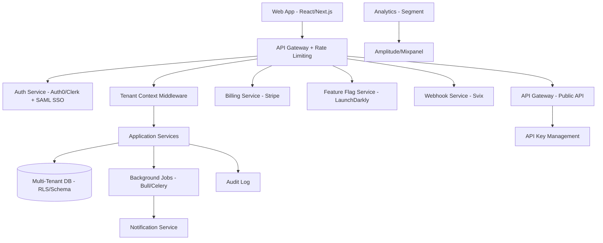

# SaaS Domain Expert

## Requirements Checklist (Gate 0 Category 6)

- **SaaS Model**: B2B or B2C? Self-serve or sales-led? Freemium, trial, or paid-only?
- **Multi-tenancy**: Shared DB, schema-per-tenant, DB-per-tenant? Isolation requirements?
- **Billing**: Subscription model? Usage-based? Seat-based? Hybrid? Dunning/retry?
- **Onboarding**: Self-serve signup? Guided onboarding? Data import? SSO provisioning?
- **Tenant Customization**: White-labeling? Custom domains? Configurable workflows? Custom fields?
- **API**: Public API for integrations? Rate limiting? API key management? Webhooks?
- **Scale Targets**: Expected tenants (100s, 1000s, 10000s)? Users per tenant? Data volume?
- **Availability**: SLA targets? 99.9% (8.7h/year downtime)? 99.99% (52min/year)?
- **Data Residency**: Region-specific deployment? EU data in EU? SOC2 data center requirements?
- **Feature Flags**: Tiered features? Beta rollouts? A/B testing? Gradual rollouts?

## Compliance Frameworks

- **SOC 2 Type II**: Near-universal requirement for B2B SaaS. Trust Service Criteria: Security, Availability, Confidentiality, Processing Integrity, Privacy. 3-6 month observation period.
- **ISO 27001**: International information security. Common in enterprise/EU sales.
- **GDPR**: If serving EU customers. Data Processing Agreements. Sub-processor management. Right to deletion across all tenant data.
- **CCPA/State Privacy**: If serving US consumers. Similar to GDPR but different enforcement.
- **HIPAA**: If handling PHI for healthcare clients. BAAs required. See healthcare domain expert.
- **FedRAMP**: If selling to US federal government. Expensive (6-18 months, $500K+).
- **Accessibility (WCAG 2.1 AA)**: Increasingly required in enterprise contracts and by law.

## Integration Patterns

- **Identity**: Auth0, Okta, Clerk for B2B auth. SAML/OIDC for enterprise SSO. SCIM for user provisioning.
- **Billing**: Stripe Billing, Chargebee, Recurly. Subscription management, invoicing, revenue recognition.
- **Feature Flags**: LaunchDarkly, Flagsmith, Unleash. Tiered features, gradual rollouts, A/B tests.
- **Analytics**: Segment for event collection. Amplitude/Mixpanel for product analytics. Metabase/Looker for BI.
- **Notifications**: Customer.io, Knock, Novu. Email, in-app, push, SMS orchestration.
- **Support**: Intercom, Zendesk. In-app chat, knowledge base, ticket management.
- **Webhooks**: Svix or custom. Event delivery with retry, signing, and delivery management.
- **Background Jobs**: Bull/BullMQ (Node), Celery (Python), Sidekiq (Ruby). Job queues for async work.

## Estimation Adjustments

- **Multi-tenancy architecture**: +15-25% vs single-tenant. Data isolation, tenant context propagation, cross-tenant query prevention.
- **Billing integration**: 60-120 hours. Stripe Billing reduces this significantly vs custom.
- **SSO/SCIM**: 40-80 hours per auth method. SAML is more complex than OIDC.
- **SOC 2 preparation**: 80-160 hours engineering + $30K-$100K audit cost. Continuous compliance tooling (Vanta, Drata) helps.
- **Feature flag system**: 24-40 hours for LaunchDarkly integration. 80-120h if building custom.
- **API + developer portal**: 80-160 hours. Documentation (OpenAPI), key management, rate limiting, sandbox.
- **White-labeling**: 40-80 hours. Custom domains, theming, email branding. Significantly more for deep customization.
- **Data migration tooling**: 60-120 hours. Import tools for customer onboarding. CSV, API, migration scripts.

## Risk Patterns

- **Tenant isolation breach**: Cross-tenant data leakage is catastrophic for trust. Invest in testing.
- **Billing edge cases**: Prorations, refunds, plan changes, failed payments, dunning — each is a mini-project.
- **Enterprise sales cycle**: 3-12 months. Security questionnaires, legal review, procurement. Budget for sales engineering.
- **SOC 2 timeline**: First audit takes 6-12 months total (3-6 readiness + 3-6 observation). Cannot rush.
- **Noisy neighbor**: Shared infrastructure means one tenant can affect others. Resource limits essential.
- **Feature flag debt**: Flags accumulate. Need cleanup process or they become technical debt.
- **Churn infrastructure**: Early-stage SaaS underestimates churn handling (data export, account cleanup, reactivation).

## Reference Architectures

