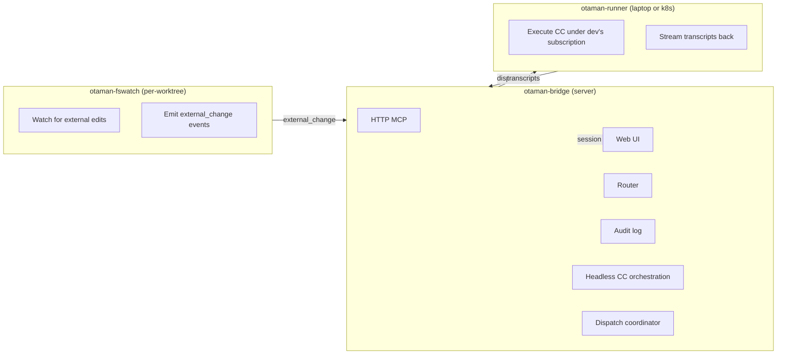

# Otaman Phase 8+ Roadmap

> Forward-looking implementation plan for the collaborative team mode arc.
> Companion to `references/project-brief.md` (current state).
> Snapshot: 2026-04-30. No code yet; design is in flight.

This document is built to be shared with claude.ai conversations for further design work — schemas, diagrams, and decision matrices that benefit from the canvas environment. Treat each section as a discussion seed.

---

## 0. Reading guide

- **Sections 1–4**: settled context (strategic frame, deployment modes, components, decisions). Read first.
- **Sections 5–7**: open work (load-bearing decisions, lock-ins, capability matrix, schemas to spec). The discussion targets.
- **Section 8**: phased plan from Phase 8 through Phase 13 + the legacy backlog items.
- **Section 9**: recent learnings (last 7 days) that affect Phase 8 design.
- **Section 10**: explicit open questions framed for claude.ai conversations.

---

## 1. The Big Arc

Otaman today is a solo-developer plugin with optional Telegram-based remote approval. Phase 8+ evolves it into a multi-developer team platform with optional on-prem enterprise deployment, while keeping the solo experience intact.

### Why now

Roman is growing the company. The GitHub ACE presentation ("one developer, two dozen agents, zero alignment", Maggie Appleton) demonstrated the cloud-workspace direction the industry is heading. ACE-style platforms are:

- microVM-per-session expensive
- single-vendor locked (Copilot)
- sync-chat oriented

Roman's market — B2B regulated industries (HIPAA / ISO 27001 / GDPR) — wants the **opposite**: async, BYO agent, multi-repo, on-prem, git-native. Otaman's defensible position is the inverse of ACE; don't try to out-ACE ACE.

### Strategic positioning (settled)

| Defensible angle | Why it beats ACE/Copilot/Cursor |
|---|---|
| **Async-first** | Bus + Telegram already prove this works. ACE community comments confirmed real teams are async. |
| **Git-native** | Audit, rollback, offline, regulated-industry compliance. ACE doesn't think this way. |
| **Multi-repo** | ACE is single-workspace. Real B2B platforms are 8+ repos. |
| **BYO agent** | Community already complaining ACE locks to Copilot. Otaman routes any LLM. |
| **Self-hostable, on-prem ready** | Community is asking for it; nobody serving regulated industries cleanly. |

**Don't compete on real-time multiplayer prompting.** That's not the killer feature. Structured async handoff beats it for distributed teams.

---

## 2. Five Deployment Modes

One codebase, mode-flag gating, not five products.

### Mode topology

```mermaid
flowchart TB
    subgraph Mode1["Mode 1 — Full local (solo)"]
        M1Dev[Developer laptop]
        M1Repos[(Local repos<br/>+ otaman folder)]
        M1Bridge[Bridge<br/>OPTIONAL]
        M1Dev --> M1Repos
        M1Dev -.optional.-> M1Bridge
        M1Bridge -.optional web UI.-> M1Dev
    end

    subgraph Mode2["Mode 2 — Remote launcher (LAN)"]
        M2Devs[Many developers]
        M2Server[Shared Linux server]
        M2Bridge[Host-based bridge<br/>MANDATORY]
        M2Repos[(Server-side repos<br/>+ otaman folder)]
        M2Devs -- SSH --> M2Server
        M2Server --> M2Bridge
        M2Bridge --> M2Repos
    end

    subgraph Mode3["Mode 3 — Basic enterprise"]
        M3Devs[Developers]
        M3WebUI[Web UI]
        M3Container[Docker container<br/>headless CC]
        M3Clones[(Per-user repo clones<br/>+ per-session worktrees)]
        M3Devs -- HTTPS / IDE Remote SSH --> M3WebUI
        M3WebUI --> M3Container
        M3Container --> M3Clones
    end

    subgraph Mode4["Mode 4 — Advanced enterprise"]
        M4WebUI[Web UI + SSO]
        M4Container[Container + sidecars]
        M4LLM[Local LLM<br/>vLLM]
        M4Redact[Redaction<br/>Presidio]
        M4Audit[Hash-chain audit]
        M4WebUI --> M4Container
        M4Container --> M4LLM
        M4Container --> M4Redact
        M4Container --> M4Audit
    end

    Mode5["Mode 5 — SaaS<br/>(suspended)"]
```



### Per-mode rough sketch

| | Mode 1 Local | Mode 2 LAN | Mode 3 Basic Ent | Mode 4 Adv Ent | Mode 5 SaaS |
|---|---|---|---|---|---|
| Bridge required | optional | mandatory | mandatory | mandatory | mandatory |
| Bridge shape | per-account | host-based | container | container | multi-tenant |
| Web UI | optional (lite) | useful | yes | yes | yes |
| Auth | none | per-user token | login/pass + OIDC | OIDC + SAML + TOTP | Multi-tenant SSO |
| Audit log | local files | local files | container volume | hash-chain + KMS | per-tenant |
| Redaction | none | none | none | Presidio sidecar | per-tenant policy |
| Local LLM | no | no | optional | yes (vLLM) | yes |
| Multi-user | n/a | "pass the mic" | session writers + spectators | + RBAC | + tenants |
| Repo storage | host filesystem | host filesystem | per-user clones + worktrees | same | same |
| Conversation persistence | yes (JSONL) | yes | yes (volume) | yes + audit | yes |
| `otaman-fswatch` | optional | optional | yes | yes | yes |
| `otaman-runner` | n/a | n/a | optional (laptop) | yes | yes |
| Custom domain / TLS | n/a | n/a | yes | yes | per tenant |
| Deployment unit | binary | binary | Docker image | Docker + sidecars | K8s |

This is the rough sketch, **not** the full capability matrix — that's deliverable #1 (see Section 6).

### Mode 1 — Full local (solo / small simple project)

- Launcher points to local folder containing repos + otaman folder
- Claude Code CLI via otaman launcher; **bridge optional** (no bridge = no Telegram, no web UI; just CLI + files)
- If user wants web UI locally: same container/daemon binary in lite mode (execution adapters off, license-gated), runs on `localhost`
- No auth needed when bridge is local-only
- Multi-profile (Claude subscription management), multi-repo, multi-OS (Win/Unix/Mac)
- Notifications without bridge: just "open Claude Code, see unread count" — fine for solo
- No on-prem server needed
- **The simple/convenient mode.** Solo + simple projects.

### Mode 2 — Remote launcher (LAN/mesh, current setup)

- Same launcher but agents run on remote server; dev's laptop is a thin shell
- Convenient for big projects: many agents, tests, builds running on server
- **Bridge mandatory** for collaboration (already used for Telegram notifications today)
- Web UI useful for managing specs/status/documentation/artifacts
- **Multi-user collaboration model**: one writer per session + Zoom-style host transfer ("pass the mic"). Read-only spectators join via web UI live transcript. Comments + suggestions flow as bus messages. **NOT** real-time multi-prompting on the same agent.
- Teammates launch own Claude Code sessions on the same server, **reuse one host-based bridge** for collaboration
- **Bridge is host-based, not per-account.** One bridge process per host serves all teammates' SSH sessions. Endpoint file at `/var/run/otaman/bridge.endpoint` (shared, mode 0644 or world-readable group). Per-user identity inside (each user's CC session presents a token); same-user-trust no longer enough.
- Slack / Teams / Telegram support for on-call / unblock policy (adapter pattern; Telegram exists today, others slot in)
- All chat logs with agents kept (conversation persistence active)
- Good for solo + small teams (3–5 people)
- **Still not enterprise** — no Docker, no multi-tenancy, but the bridge shape lines up with Mode 3+

### Mode 3 — Remote dev via web UI (basic enterprise)

- Docker deployment on customer's server — **one container serves all teammates**
- Headless Claude Code on container translates web prompts into actions
- **Does NOT run in user Unix sessions** on the server — runs in container session
- **Repo model: per-user full git clones** (NOT bare clones + worktree pool). Each teammate gets their own clone of the relevant repos in their container-side workspace. Inside each user's clone, **per-session git worktrees** for parallel branches (e.g. `auth-service.tree/feature-x/`, `auth-service.tree/bugfix-y/`) — kilobytes overhead each, no full duplication. Storage cost accepted (linear per user, not per session).
- **IDE Remote SSH access supported** — VS Code / JetBrains can attach directly to the container, point at a user's clone, edit files outside Claude Code. Same source of truth.
- **`otaman-fswatch`** detects edits made outside Claude Code (VS Code Remote, vim, `git pull`) and notifies the bridge so the responsible agent's session can react. Defer impl to Phase 10/11; lock event shape in Phase 8.
- **PRs**: each user has their own PAT for git host; PRs default to human review (configurable to allow agent merge but not recommended)
- **Bridge mandatory**
- **Auth tiers**:
  - Default: simple login/pass (web UI). Enough for small teams + solo running locally. Local dev = no auth needed.
  - Optional bundle: Keycloak or Authentik shipped in the container (gated by license/config) for "platform on separate server" cases — same OIDC code path as Mode 4, no auth subsystem divergence.
  - Enterprise feature: password complexity + lockout policies (audit requirement even without SSO)
  - Optional: TOTP / second factor
- No multi-tenancy (one customer per container, own data volume)

### Mode 4 — Remote dev via web UI (advanced enterprise)

Mode 3 + the following:
- Local LLM connection via OpenAI-compatible API, routed by classification (vLLM sidecar, GPU-required, gated behind compose profile)
- **Enterprise SSO**: OIDC built-in handles 95%; SAML via auth-proxy sidecar (oauth2-proxy / Authelia) — don't put SAML library in otaman binary
- Compliance mode: PHI/PII masking via Presidio sidecar (per-tool-call redaction, not just per-prompt)
- Audit trails with hash-chain tamper evidence (each entry includes hash of previous; KMS-anchored root for highest tier)
- No multi-tenancy

### Mode 5 — SaaS (suspended)

All of Mode 4 + multi-tenancy + subscription billing. Defer until a paying customer asks. SaaS is a different business than plugins (auth, billing, multi-tenancy, uptime, RBAC, support, SOC2 — 10× operational commitment).

---

## 3. Three Named Components



- **`otaman-bridge`** — server-side: HTTP MCP, web UI, router, audit, headless CC orchestration, dispatch coordinator. Modes 2–5.
- **`otaman-runner`** — laptop or runner-side: receives dispatch jobs from bridge, runs Claude Code under dev's subscription on dev's actual files, streams transcripts back. Customer K8s/CI runners are also runners — same protocol. Solves the enterprise dilemma: container-side headless CC consumes container's API key + loses dev's local context; dev-side CC has no central audit. Container = brain; laptop = hands.
- **`otaman-fswatch`** — per-worktree filesystem watcher: detects edits made outside Claude Code (VS Code Remote, vim, `git pull`, etc.) and POSTs `external_change` events to the bridge so the responsible agent's session can react. In-process inside the bridge or sidecar.

Bridge and runner share a feature core (e.g., optional external LLM hookup); runner is essentially a bridge with execution-only surfaces. Defined wire protocol between them so K8s / CI runners drop in cleanly.

---

## 4. Architectural Decisions (settled)

The eight decisions that locked during the 2026-04-27..28 design sessions:

1. **HTTP MCP co-located in the bridge daemon**, not a separate service. Bridge is **host-based** in Modes 2–4 (one process serves all teammates on the host); per-user identity inside, per-host process outside. Endpoint file moves to `/var/run/otaman/bridge.endpoint` (shared) when running multi-user; stays at `~/.otaman/bridge-<account>.endpoint` for solo. Stdio MCP fallback for users without a daemon installed.

2. **Claude Code as execution backend** (headless `claude -p` subprocesses), **not** a custom agent loop on the Claude API. Reuses tools, hooks, MCP, plan mode, agents. Building on the API directly is a 12-month detour.

3. **Conversation transcript persistence is a real gap**. Today bus messages persist but the agent's prompt/response history dies on compact. JSONL transcripts in `.agents/conversations/<session-id>/` is the answer. Feeds web UI dashboards and audit trails.

4. **Three named components** with defined wire protocols (see Section 3).

5. **Web UI is a *fourth surface* on the same bus**, not a replacement for Telegram or Claude Code:
   - **Telegram** = phone / urgent / 1:1
   - **Web UI** = laptop / threaded / multiplayer planning
   - **Claude Code** = where you actually code
   - **Bus** = the durable layer all three read/write

6. **One container, license-gated features.** Container ships with web UI built-in regardless of mode; capabilities (vLLM router, audit hash chain, OIDC, multi-tenancy) toggled by license/subscription tier. Solo users can run the same container locally and get the dashboard.

7. **Multi-user collaboration model: one writer + Zoom-style host transfer.** Per-session: exactly one writer (the user who started it), read-only spectators can join via web UI live transcript, comments + suggestions flow as bus messages, write responsibility transferable to another teammate ("pass the mic"). Beats real-time multi-prompting on predictability and async fit.

8. **Layered config files, not a fat `platform.yaml`.** Decouple complexity into focused files cross-referenced by ID. See artifact registry below.

### Artifact registry

| Artifact | Location | Owner |
|---|---|---|
| Repos, basic project meta | `platform.yaml` | otaman |
| Components (cross-repo, requirements, dependencies) | `components.yaml` (NEW, Phase 9) | otaman |
| Agents + specialties + ownership areas + SLAs | `.agents/agents.yaml` (extended, Phase 9) | otaman |
| Specs (proposals/design/tasks) | OpenSpec repo | OpenSpec |
| ADRs | `.agents/decisions/` | otaman |
| Bus messages | `.agents/bus/` (Mode 1–2); container volume + git export queue (Mode 3+) | otaman |
| Conversations | `.agents/conversations/` (NEW, JSONL, Phase 8) | otaman |
| Reviews | `.agents/reviews/` | otaman |
| Routing policy | `routing.yaml` (Phase 8 / Mode 4) | otaman |

**Rule:** keep each file human-editable. Don't bloat `platform.yaml` with component or routing detail.

---

## 5. Three Load-Bearing Decisions Still to Settle

These three **block** Phase 8 from starting cleanly. Direction is set; details to spec.

### 5.1 Bus storage location

**Today**: files in customer's project repo.

**Options**:
- **A.** Stays in customer git repo — slow, conflict-prone with multi-user
- **B.** Container volume — fast, loses git audit
- **C. Hybrid (RECOMMENDED, Roman picked)**: container canonical + periodic git export queue
  - Modes 1–2 use local files (today's behaviour)
  - Mode 3+ uses container volume as canonical store
  - Background queue exports periodically to a separate bus-archive git repo for audit
  - Read path: container first, fall back to git archive for old messages

**To spec**:
- Export queue cadence (every commit? every N minutes? on bus archive trigger?)
- Conflict resolution when the same message exists in both places (timestamp wins? container wins?)
- Wire format for the export — same `.md` files? newline-delimited JSON? Both?

### 5.2 Hot-path hook strategy

**Problem**: `PreToolUse` + `UserPromptSubmit` fire on every prompt. Network round-trip to a container for ownership / approval / status checks is too slow.

**Solution direction**: local mirror with TTL refresh + fail-closed when stale > threshold.

**To spec**:
- TTL value (10s? 60s? configurable per deployment)
- Mirror format (single JSON snapshot? sqlite? key-value store?)
- Refresh trigger (poll? signal-based? both?)
- Fail-closed semantics (block tool? warn? log only?) — likely tiered by hook
- What happens when the bridge is unreachable — graceful degrade per hook

This also intersects with today's Bash-CLI-vs-MCP split (Section 9) — hot-path hooks must NOT depend on MCP tool schema loading.

### 5.3 Redaction model

**Scope**: per-tool-call interception (not per-prompt — tool outputs contain data too). Only active in Mode 4.

**Two-tier policy**:
- `regulated`: never leaves perimeter, route to `LocalLLMAdapter`, fallback REJECT
- `internal`: Claude allowed with redaction
- `public`: Claude direct

**Hallucinated tokens** (Claude returns `<PERSON_47>` we never sent): log, escalate, persist decision and reuse on the same session.

**To spec**:
- Tag wire format (consistent with Presidio's defaults? otaman custom?)
- Reverse-mapping store (per-conversation? per-session? in audit log?)
- REJECT escalation path (back to user via Telegram? web UI?)
- What happens when classifier itself is uncertain — fail to which tier?

---

## 6. Five Phase 8 Lock-Ins (cheap now, expensive later)

These add ~1 week to Phase 8 and unlock Phases 9–12:

1. **All paths via env** (`OTAMAN_DATA_DIR`); no hardcoded `~/.otaman/`. Container deployments need this.

2. **Storage layer behind an interface** (`BusStore.read_messages(project)`, etc.); local-fs impl now, S3/Postgres impl later. The hybrid model (5.1) is implemented as two `BusStore` impls + a coordinator.

3. **Secrets chain adds mounted file** before keyring (`/run/secrets/otaman-token`); keyring won't work in containers.

4. **Auth with pluggable validators** (today: bearer in endpoint file; later: OIDC JWKS validation; same `Authorization: Bearer` shape, swap validator).

5. **Structured JSON logs to stdout + `/metrics` Prometheus endpoint**. Containers need this for ops.

These five are non-negotiable for Phase 8 — without them, Phases 11/12 require painful retrofits.

---

## 7. Two Artifacts to Produce Next (BEFORE coding starts)

### 7.1 Per-mode capability matrix

~30 rows × 5 mode columns. Forces explicit yes/no/conditional on every capability dimension.

**Why**: surfaces inconsistencies between modes BEFORE coding. The rough sketch in Section 2 is ~15 rows; the full matrix should hit ~30.

**Sample rows to flesh out**:

| Capability | Mode 1 | Mode 2 | Mode 3 | Mode 4 | Mode 5 |
|---|---|---|---|---|---|
| Web UI surface | optional (lite) | useful | required | required | required |
| Auth — login/pass | n/a | n/a | default | default | per tenant |
| Auth — OIDC | n/a | n/a | optional bundle | required | required |
| Auth — SAML | n/a | n/a | n/a | sidecar | sidecar |
| Auth — TOTP | n/a | n/a | optional | optional | per tenant policy |
| Bridge transport | stdio | HTTP local | HTTP container | HTTP container | HTTP multi-tenant |
| Bridge multi-user | n/a | per-user token | per-user token | per-user + RBAC | + tenant scoping |
| Bus storage | files | files | container volume + git export | + audit hooks | per-tenant |
| Conversation persistence | yes | yes | yes | yes + audit chain | per tenant |
| Hot-path hook mirror | n/a | local file | sqlite mirror | sqlite + audit | per tenant |
| Local LLM | no | no | no | vLLM | vLLM per tenant |
| PII redaction | no | no | no | Presidio | Presidio + tenant policy |
| Audit hash chain | no | no | no | yes | yes |
| `otaman-fswatch` | optional | optional | yes | yes | yes |
| `otaman-runner` | n/a | n/a | optional | yes | yes |
| Repo model | host fs | host fs | per-user clone + worktree | same | same |
| IDE Remote SSH | n/a | yes | yes | yes | n/a (web only) |
| PR review default | manual | manual | human | human | per tenant |
| Telegram transport | optional | yes | yes | yes | per tenant |
| Slack/Teams transport | n/a | optional | optional | optional | per tenant |
| `otaman upgrade` UX | git pull | git pull | image pull | image pull | per tenant |
| Multi-tenancy | n/a | n/a | n/a | n/a | yes |
| KMS-anchored audit root | n/a | n/a | n/a | optional | per tenant |
| Compose profile gating | n/a | n/a | yes | yes | yes |
| Container size target | <100MB | <100MB | ~500MB | ~2GB (vLLM) | per tenant |
| License feature flags | n/a | n/a | yes | yes | yes |
| OpenSpec server-side | client only | client only | optional | yes | yes |
| Domain TLS / cert | n/a | n/a | bring-your-own | letsencrypt + custom | per tenant |
| Backup model | git | git | volume snapshot | + audit export | per tenant |
| Update strategy | git + init | git + init | rolling image | rolling + sidecar | blue-green |

This is illustrative, not final. The artifact will live at `references/phase-8-capability-matrix.md` and become the source of truth.

### 7.2 Three-decisions document

Short doc fixing the three load-bearing choices (5.1, 5.2, 5.3) with mode awareness. ~5 pages. Format:

```
For each decision:
  - Statement of choice
  - Per-mode behaviour (Mode 1 / Mode 2 / Mode 3 / Mode 4 / Mode 5 columns)
  - Wire formats and schemas
  - Failure modes and graceful degrade
  - Open questions explicitly framed
```

This is the brief Phase 8 codes against. Will live at `references/phase-8-three-decisions.md`.

### 7.3 Adapter contract + routing.yaml schema (third artifact)

After 7.1 and 7.2. The load-bearing API the rest of Phase 8 hangs on. **Ship v1 with three adapters and four hardcoded rules, NOT a full DSL.**

Three adapters:
- `LocalScript` — invokes a CLI on the host (today's `otaman check` etc.)
- `ClaudeAPI` — direct call to api.anthropic.com (existing pattern)
- `HeadlessClaude` — subprocess-spawned Claude Code (Phase 8 new)

Four hardcoded rules:
- "Route `regulated` data → `LocalScript` if local LLM available, else REJECT"
- "Route `internal` data with redaction → `ClaudeAPI`"
- "Route `public` data → `ClaudeAPI` direct"
- "Route session-attached agent → `HeadlessClaude` if dispatch=container, else `LocalScript` if dispatch=runner"

Lives at `references/phase-8-adapter-contract.md`. **Don't extend until pain demands.**

---

## 8. Phased plan

### Phase 8 — Foundation (months)

- HTTP MCP in bridge daemon (host-based shape)
- Conversation persistence (`.agents/conversations/<session-id>/*.jsonl`)
- Storage interface (`BusStore` Protocol, `LocalFsBusStore` impl)
- Env-paths everywhere (`OTAMAN_DATA_DIR`)
- Adapter contract v1 (`LocalScript`, `ClaudeAPI`, `HeadlessClaude`)
- Routing skeleton (`routing.yaml`, four hardcoded rules)
- Audit log (append-only, no hash chain yet)
- Pluggable auth (bearer today, OIDC validator later)
- Five lock-ins (Section 6)
- `otaman-fswatch` event shape locked (no impl)
- Mounted-file secret source

### Phase 9 — Web UI v1 + classifier

- Web UI v1 (read-only dashboard): pending bus, blocked tasks, recent reviews, agent status
- Classifier: tag content as `regulated` / `internal` / `public` (rules + LLM)
- Redaction: `LocalLLMAdapter` with vLLM (gated to Mode 4)
- `components.yaml` schema (cross-repo components, requirements, dependencies)
- `.agents/agents.yaml` extension: specialties, ownership areas, SLA fields

### Phase 10 — Web UI v2 + multiplayer

- Web UI v2: live transcript view, multiplayer prompt threads, "pass the mic"
- Per-user clone + per-session worktree subsystem (Mode 3)
- `otaman-fswatch` impl (in-process or sidecar)
- OpenSpec server-side execution (don't require user to keep specs repo open in Claude Code)
- Zoom-style write transfer

### Phase 11 — Docker packaging

- Dockerfile + Docker Compose + Helm chart
- License / feature flag layer
- Keycloak / Authentik bundled-optional (gated by compose profile)
- Should be 1–2 weeks if Phase 8 lock-ins were done right.

### Phase 12 — Managed on-prem

- First paying enterprise customer
- `otaman-runner` laptop service (cross-platform daemon)
- Audit hash chain, KMS-anchored root
- Compliance mode (Presidio sidecar)

### Phase 13 — SaaS multi-tenant

- Only if customer-pulled. Significant operational commitment.

---

## 9. Recent learnings affecting Phase 8 (last 7 days)

### 9.1 Deferred MCP tools — the LLM-instruction bridge is fragile

**Discovery (2026-04-29)**: Claude Code now lists MCP tools by name only; schemas must be fetched via `ToolSearch` before invocation. Two attempts to instruct LLMs to bridge "want to call X" → "first call ToolSearch with these args" both failed across 8 tabs.

- v1: `## Step 0: Load MCP tool schemas` block. Result: 5/8 tabs spawned subagents to "load schemas" (30k+ tokens each); 1 invoked `otaman-debug-model-agent` on semantic match of the verb "load".
- v2: rewritten as `Tool: ToolSearch / Args: ...`. Result: 0/8 tabs called ToolSearch correctly. Some treated `ToolSearch` as a shell binary (`command -v toolsearch`); others spawned subagents that ran unrelated bash.

**Fix shipped (commit `38bf77a`)**: hot-path commands use Bash CLI directly (`otaman check`, `otaman ack`, `otaman status`); structured/write-heavy commands keep MCP because lower invocation rate masks the variance.

**Phase 8 implications**:
- Hot-path hooks (5.2) MUST NOT depend on MCP tool schema loading
- The bridge's HTTP MCP surface is for *programmatic* access (web UI, runners), not for slash-command bodies to drive the LLM into calling
- New MCP tool added → also add a CLI subcommand if it's read-only and on the hot path
- The capability matrix needs a "hot-path command transport" row

### 9.2 Per-repo agent identity vs project-global

**Discovery (2026-04-30)**: `.agents/current-agent` was project-global; every tab read mobile-agent's identity because that was the last value set, regardless of which repo the tab was launched in.

**Fix shipped (commit `f652290`)**: `resolve_agent_identity(root, cwd, explicit)` now does CWD → `platform.yaml.repos[]` → owner first, fallback to current-agent. Same priority swap in `bus-status-hook.sh`. 11 tests cover the cases.

**Phase 8 implications**:
- The identity resolver is the right shape for multi-user; same priority chain extends naturally with "user identity → CWD repo → owner mapping" in Mode 3+.
- `.agents/current-agent` is keeping its role as project-global fallback. Don't delete it; it's load-bearing for tabs running in the otaman folder itself.
- Multi-user identity in Mode 2+ uses a different mechanism (token presented by each CC session), but the per-CWD repo resolution still holds.

### 9.3 Schema drift — `platform.yaml` validation lagged behind Phase 7

**Discovery (2026-04-30)**: greenbin's real `platform.yaml` rejected validation because the schema didn't include `git_host`, `git_platform`, `branching: custom`, `development_branch`, `notes`, or repo names with dots/uppercase.

**Fix shipped (commits `d1eeccd` + `58564b3`)**: schema brought current with shipped Phase 6/7 features; repo name pattern relaxed; token sources made polymorphic by `type`.

**Phase 8 implications**:
- Schema drift is a recurring failure mode. New top-level fields added to `platform.yaml` need a schema update **in the same commit**. Worth a CI check (e.g., validate the example `platform.yaml` files in `examples/` against the schema on every PR).
- The `components.yaml` and `routing.yaml` schemas (Phase 8/9) need the same discipline.

---

## 10. Open Questions for claude.ai Discussion

Concrete topics where canvas / mermaid / schema-drafting helps:

### 10.1 Wire protocol design (for Section 3 components)

- HTTP MCP request/response shapes — JSON-RPC over HTTP, or REST?
- Bridge → runner dispatch: WebSocket? Long-poll? Server-Sent Events?
- `otaman-fswatch` event shape — design now (Phase 8) for use later (Phase 10)
- Conversation transcript JSONL schema — what fields? per-event or per-turn?

### 10.2 routing.yaml v1 schema

- 4 hardcoded rules, but the YAML still needs a shape. What does it look like?
- How does it interact with `agents.yaml` specialty fields (Phase 9)?
- How does it interact with redaction tags (5.3)?

### 10.3 components.yaml schema (Phase 9)

- One component spans repos. Linking shape?
- Cross-references to specs (OpenSpec IDs), ADRs, PRs.
- Per-component dashboards in web UI — what data drives them?

### 10.4 Audit log hash chain

- Block format (per-event or per-N-events)?
- Hash algorithm + chain structure?
- KMS-anchored root: anchoring frequency, key rotation, recovery?
- Tamper-evidence verification protocol: who runs it, how often, what's the alarm path?

### 10.5 Multi-user "pass the mic" state machine

- States: `nobody-writing` / `writer-active` / `transfer-pending` / `transfer-rejected`
- Transitions: who can initiate, who can veto, what happens to in-flight Claude Code state?
- UI affordances: button placement, confirmation flow, audit entry shape

### 10.6 Per-mode capability matrix (Section 7.1)

The 30-row × 5-column matrix. Best done in claude.ai's canvas — too wide for a comfortable terminal-side conversation.

### 10.7 Token refresh in container mode

- OIDC tokens expire mid-session. Background refresh or device-flow re-auth?
- What does Claude Code's existing token model look like, and how does it interact?
- Bridge's per-user identity lifecycle vs Claude Code's session lifecycle.

### 10.8 Anthropic API key ownership in container mode

Open question:
- One shared customer key (cost attribution problem — who used what?)
- Per-user keys (key management nightmare in BYO-LLM scenarios)
- Per-tenant keys (only relevant in Mode 5)
- Roman's Claude subscription federated through `otaman-runner` (laptop = hands)

This affects pricing, ops, audit, and the dispatcher logic.

### 10.9 In-flight session state on container restart

- Headless CC sessions die — acceptable, document
- Telegram approvals stranded — today's bridge may already have this bug
- Web UI sessions: reconnect? resume? abandon?

### 10.10 otaman-fswatch event shape

Locked in Phase 8 design but not formalised. Event shape:

```jsonc
{
  "type": "external_change",
  "timestamp": "2026-04-30T12:34:56Z",
  "repo": "auth-service",
  "worktree": "auth-service.tree/feature-x",
  "user": "alice",                      // user who owns the worktree
  "agent": "backend-agent",             // owner agent for the repo
  "session_id": "...",                   // attached session if any
  "paths_changed": ["src/login.ts", "src/auth.ts"],
  "change_kind": "edit",                 // edit | add | delete | rename
  "source": "vscode-remote-ssh",         // best-effort label
  "git_status": { "ahead": 2, "behind": 0, "unstaged": 4 }
}
```

Open: how does the bridge route this to the right agent session? What's the agent's expected reaction (re-read files? abort current task?)?

---

## 11. Cross-Cutting Product Concerns (Phase 12+ work)

Roman's three product goals + how each is approached. **Doable on the proposed infrastructure** — these are product work, not platform work.

### 11.1 Async use of team-member expertise

- **Start simple**: extend `agents.yaml` with `specialty` / `ownership_areas` / `sla` fields + small routing rules in YAML
- Bus + plain text isn't ideal long-term but don't overengineer; pilot it for some period, migrate to richer model only if pain demands
- Phase 9 work, after `routing.yaml` + adapter contract are stable

### 11.2 Convenient work with specs / process / contracts / test coverage

- **Wiki-style markdown hierarchy + C4 architecture browsing** (mermaid format, already a standard)
- Don't reinvent the wheel — what's needed is **a systematic registry**, not a new Jira
- Miro/Milanote-style deep-dive UI for layer navigation is **aspirational**; might build on top later
- Read-only dashboards first, in Phase 9 web UI v1

### 11.3 Monitor + implement technical requirements per architecture component

- Separate `components.yaml` (NOT a fat `platform.yaml` block) where one component spans repos, links requirements, names owners
- Per-component dashboards in web UI
- Cross-referenced by ID with specs / ADRs / PRs (`COMPONENT-AUTH-API`, `ADR-2026-04-15-token-storage`, `SPEC-payments-multicurrency`)

---

## 12. Backlog (legacy items, parked but well-defined)

From `CLAUDE.md` and `MEMORY.md`. Each is independent; can be slotted into any phase.

- **Domain coverage gap** — every domain should have both a skill reference file (`skills/{cto-advisor,project-estimator}/references/domains/<d>.md`) AND an MCP payload (`references/domain-experts/<d>.md`). Current gap: `gaming`, `drones-uav`, `embedded-iot` exist only in skills; `marketplace`, `saas`, `iot` exist only in MCP. Both sides need filling out.

- **PM tool integration** — pull backlogs from Jira / Linear / GitHub Projects / Asana / Notion / Azure DevOps into otaman. Same PAT/OAuth pattern as git hosts. Imports tickets as `task-assignment` bus messages; completion flows back via `otaman complete`. Provider abstraction in `scripts/pm_sync.py`. Jira + Linear first. Probably Phase 9–10 territory.

- **Bitbucket Data Center / Server adapter** — separate REST base from Cloud. Defer until a real user self-hosts.

- **Inline / line-level review comments** — current `GitHostAdapter` only supports issue-level. Inline comments need different endpoints per provider. Either extend the Protocol or add a parallel `GitHostReviewAdapter`. Wire `/otaman:review` to emit them. Phase 9 nice-to-have.

- **Auto-post `/otaman:review` to PR** — today writes to `.agents/reviews/pending/`, then user runs `otaman git-host post-review` separately. Add a `--post-to-pr` flag.

- **`otaman upgrade` workflow** — current path is `git pull` + `/otaman:init` per platform + restart tabs. CLI that walks all known platforms (the launcher already inventories them) and refreshes. Worth a Phase 8 side-quest — relevant to Mode 3+ where users won't have a launcher at all.

- **Block-version markers in per-repo CLAUDE.md** — write `<!-- otaman:version 0.2.3 -->`. SessionStart hook detects stale and posts a one-line nudge. Fits with `otaman upgrade` as a coupled improvement.

- **Self-healing init** — split `otaman init` into a fast `init --refresh-only` that just rewrites the otaman:begin/end block + ownership.json + .otaman markers. Safe to run on every plugin upgrade. Pairs with version markers.

- **Plugin marketplace listing** — once published, `claude plugin update otaman` becomes a one-liner and the rollout pain disappears. Independent of phase work.

---

## 13. Glossary

| Term | Meaning |
|---|---|
| Mode 1–5 | The five deployment modes (Section 2). Locked. |
| `otaman-bridge` | Server-side daemon. HTTP MCP, web UI, router, audit, headless CC orchestration. |
| `otaman-runner` | Laptop or runner-side service. Executes Claude Code under dev's subscription on dev's files. |
| `otaman-fswatch` | Filesystem watcher. Detects edits made outside Claude Code. |
| Headless CC | `claude -p` subprocess with structured I/O — no interactive terminal. |
| Bus | File-based message queue at `.agents/bus/` (Modes 1–2) or container volume + git export (Mode 3+). |
| Pass the mic | Multi-user write-transfer pattern. One writer per session at a time. |
| Hot-path hook | A hook that fires on every prompt/tool — must be sub-100ms. |
| Adapter | Pluggable execution backend. Three v1: `LocalScript`, `ClaudeAPI`, `HeadlessClaude`. |
| Routing | Decides which adapter handles a given action, based on data classification. |
| Lock-ins | Five Phase 8 must-haves (Section 6) that are cheap to add now, painful to retrofit. |
| Capability matrix | The ~30 × 5 grid documenting what each mode supports (Section 7.1). |

---

*End of roadmap. The next concrete deliverables are the per-mode capability matrix (Section 7.1) and the three-decisions document (Section 7.2). Drop this file into a claude.ai conversation and start with whichever feels most urgent.*
